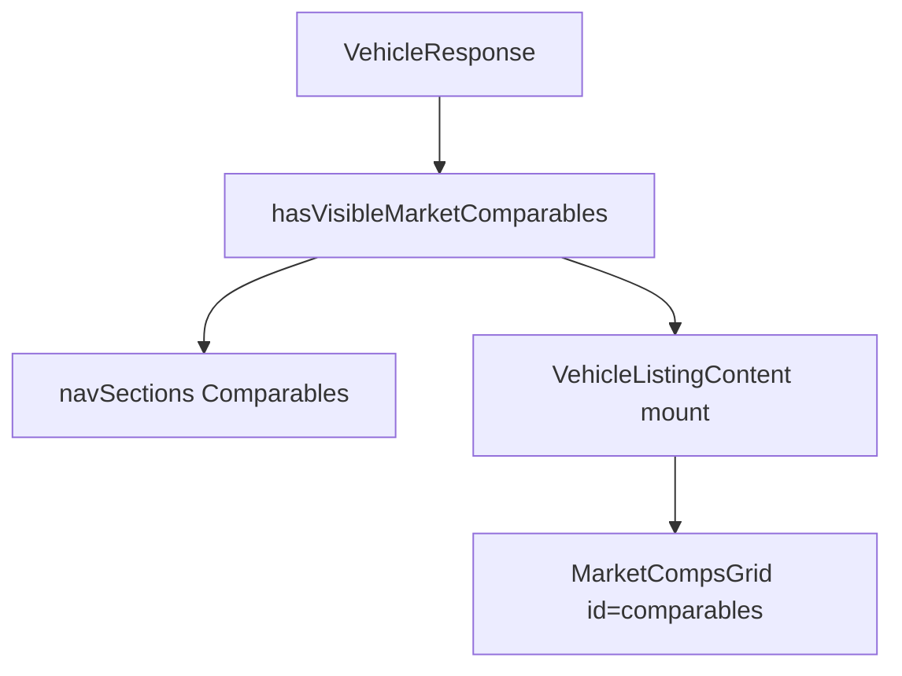

# Comparables Section Extraction — Phase 1 & 2 (Executable)

**Status:** Ready to implement  
**Parent:** [PLAN_COMPARABLES_SECTION.md](PLAN_COMPARABLES_SECTION.md)  
**Scope:** Public layout extraction + nav/anchors only (no seller UI split).

---

## Context

Comps already render after `MarketChart` via `MarketCompsGrid`, but:

- The grid section has **no** `id="comparables"` for sticky nav / deep links.
- Nav from `buildVehicleListingView()` has **no** Comparables entry.
- Astro mounts on `comparables.length > 0`, so an all-`highlighted` list can hydrate an island that returns `null`.

Use type **`VehicleResponse`** (not `Vehicle`) — that is what `buildVehicleListingView` already accepts.



---

## Task 1 — Navigation logic & empty-state helper

**File:** [`src/lib/vehicle-listing-view.ts`](src/lib/vehicle-listing-view.ts)

### 1a. Export helper

```ts
export function hasVisibleMarketComparables(vehicle: VehicleResponse): boolean {
  return (vehicle.marketValuation?.comparables ?? []).some((c) => !c.highlighted);
}
```

### 1b. Push nav item

Immediately after the existing `market` push (~171–173):

```ts
if (vehicle.marketValuation) {
  navSections.push({ id: 'market', label: 'Market Value' });
}
if (hasVisibleMarketComparables(vehicle)) {
  navSections.push({ id: 'comparables', label: 'Comparables' });
}
```

**Do not** add `comparables` to `DESKTOP_SHORTCUT_IDS` in [`VehicleSectionNav.tsx`](src/islands/VehicleSectionNav.tsx) — it stays under More / mobile drawer (same as Market Value).

---

## Task 2 — Update the island wrapper

**File:** [`src/islands/MarketCompsGrid.tsx`](src/islands/MarketCompsGrid.tsx)

The island already returns a `<section>` — **update it**; do not nest a second section.

1. Outer section:

```tsx
<section
  id="comparables"
  className="mb-16 pt-8"
  aria-labelledby="comparables-heading"
>
```

2. Heading block (keep subcopy + `mb-8` header wrapper; rename title):

```tsx
<div className="mb-8">
  <h2 id="comparables-heading" className="mb-2 text-2xl font-bold text-slate-900">
    Comparables
  </h2>
  <p className="text-sm text-slate-500">
    External dealer listings for market context and price reference only.
  </p>
</div>
```

3. Keep unchanged:

- `visibleComps = comps.filter((c) => !c.highlighted)`
- Early `return null` when `visibleComps.length === 0`
- Card grid markup

Note: `mb-2` + helper matches the current comps header. Gallery’s `mb-6` is for heading-only sections without subcopy.

---

## Task 3 — Astro mount gate

**File:** [`src/components/VehicleListingContent.astro`](src/components/VehicleListingContent.astro)

1. Import `hasVisibleMarketComparables` from `../lib/vehicle-listing-view` (with existing listing-view imports).

2. Replace the mount block (~549–556) with:

```astro
{
  hasVisibleMarketComparables(vehicle) && vehicle.marketValuation?.comparables && (
    <MarketCompsGrid
      client:visible
      comps={vehicle.marketValuation.comparables}
    />
  )
}
```

3. Keep mount **after** `MarketChart` and **before** `#features` — independent of `#market` so scroll-spy can track Comparables separately.

---

## Task 4 — Validation

| Check | Expected |
|-------|----------|
| `npx astro check` | 0 errors |
| Listing with ≥1 non-highlighted comp | More → **Comparables** scrolls to `#comparables`; heading reads Comparables |
| All comps `highlighted` or empty comps | No grid hydrate; no Comparables nav item |
| `#market` / chart | Unchanged when only highlighted comps remain |

---

## Out of scope

- Seller Details section split / copy updates (Phase 3)
- Firestore / schema changes
- Desktop top-nav shortcut for Comparables
- Nesting comps inside `#market`

---

## Implementation todos

1. `hasVisibleMarketComparables` + `navSections` push in `vehicle-listing-view.ts`
2. `MarketCompsGrid`: `id="comparables"`, heading **Comparables**, keep subcopy/grid
3. `VehicleListingContent.astro`: mount via `hasVisibleMarketComparables`
4. Run `npx astro check`
