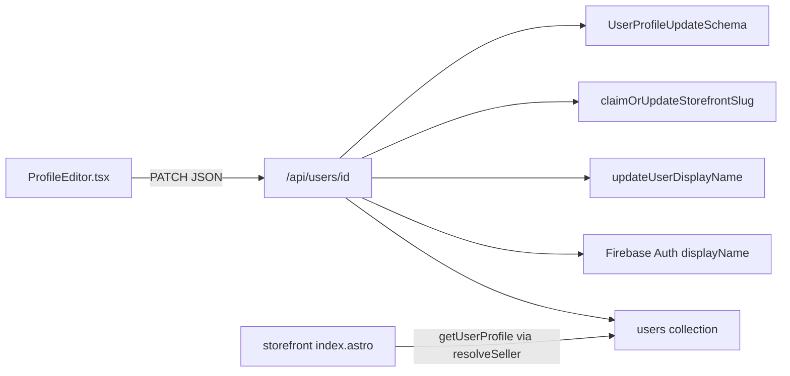

# Storefront Branding Blueprint

Architecture plan for seller-customizable storefront name, tagline, and hero image on public storefront landing pages. **Documentation only** — no application code in this change.

---

## 1. Goal and non-goals

### Goal

Sellers can brand their public storefront (`/marketplace/clothing/[storefrontSlug]`) with:

| Field | Purpose |
|-------|---------|
| `storefrontName` | Public storefront title (overrides `displayName` on the landing page) |
| `storefrontTagline` | Short supporting line under the name |
| `storefrontHeroUrl` | Full-bleed hero banner image URL |

Account `displayName` remains the platform identity (auth, messages, seller chrome). Storefront branding is presentation-only for the public landing page (and SEO when set).

### Non-goals (v1)

- Changing `storefrontSlug` claim/uniqueness rules
- Hero crop UI (upload + URL is enough; optional crop later)
- Per-listing branding overrides
- Branding on nested listing detail headers beyond using existing seller resolution
- Hard requirement that every seller set branding (all fields optional with fallbacks)

---

## 2. Current profile data flow



| Layer | Today |
|-------|--------|
| [`UserSchema`](src/schemas/index.ts) | `displayName`, `storefrontSlug`, slug metadata — **no** branding fields |
| [`UserProfileUpdateSchema`](src/schemas/index.ts) | `displayName` + optional `storefrontSlug` only |
| [`PublicUserResponseSchema`](src/schemas/index.ts) | Public GET/PATCH response — slug only beyond displayName/stats |
| [`PATCH /api/users/[id]`](src/pages/api/users/[id].ts) | Claim slug → update displayName → sync Auth → return public user |
| [`ProfileEditor.tsx`](src/islands/buyer/ProfileEditor.tsx) | Display name + storefront URL inputs; PATCH body matches update schema |
| Storefront index | Renders `seller.displayName` + static “Apparel storefront”; SEO via `buildStorefrontSeoTitle/Description(displayName)` |
| Image upload pattern | Client Firebase Storage (`uploadBytesResumable`) e.g. `apparel-images/{sellerId}/…` in [`BasicMultiUploader.tsx`](src/islands/seller/BasicMultiUploader.tsx) |

---

## 3. Phase 1 — Schema and API

### Schema additions ([`src/schemas/index.ts`](src/schemas/index.ts))

Add to `UserSchema` (all optional):

```ts
storefrontName: z.string().trim().min(1).max(50).optional(),
storefrontTagline: z.string().trim().min(1).max(150).optional(),
storefrontHeroUrl: httpHttpsUrl.optional(),
```

Also expose on:

- `PublicUserResponseSchema` — so GET/PATCH clients and SSR can read branding
- `UserProfileUpdateSchema` — accept on PATCH:
  - `storefrontName` / `storefrontTagline`: optional strings (allow empty string to **clear**)
  - `storefrontHeroUrl`: optional `httpHttpsUrl` or empty string to clear

**Clearing convention:** empty string in PATCH means delete/unset the field in Firestore (`FieldValue.delete()` or omit + explicit null handling). Prefer documenting: empty string → remove field.

### API ([`src/pages/api/users/[id].ts`](src/pages/api/users/[id].ts))

1. Extend GET mapping to include the three branding fields from the user doc.
2. After slug claim + displayName update, persist branding fields on `users/{id}` (new helper e.g. `updateUserStorefrontBranding` in [`buyer-profile.ts`](src/lib/buyer-profile.ts), or a single `updateUserProfile` that merges allowed fields).
3. Return branding fields in `PublicUserResponseSchema` parse.
4. Do **not** sync `storefrontName` to Firebase Auth `displayName` (Auth stays account display name).

### Validation notes

- Max lengths: name 50, tagline 150 (as specified).
- Hero URL must pass existing `httpHttpsUrl` (http/https only).
- No uniqueness constraint on `storefrontName` (unlike slug).

---

## 4. Phase 2 — Seller UI (dashboard)

### Profile editor ([`src/islands/buyer/ProfileEditor.tsx`](src/islands/buyer/ProfileEditor.tsx))

1. Extend props with optional `storefrontName`, `storefrontTagline`, `storefrontHeroUrl` (from account page SSR profile).
2. Add form section **Storefront branding** (below slug or adjacent):
   - **Storefront name** — text input, `maxLength={50}`, placeholder e.g. “Shown on your public storefront”
   - **Tagline** — text input or short textarea, `maxLength={150}`
   - **Hero image** — file input + preview; upload then store download URL in local state
3. Include branding fields in PATCH body alongside `displayName` / `storefrontSlug`.
4. Wire account page ([`src/pages/account/index.astro`](src/pages/account/index.astro)) to pass initial branding props from `getUserProfile`.

### Hero upload approach

Reuse the client Firebase Storage pattern from apparel uploads:

| Step | Detail |
|------|--------|
| Path | `storefront-heroes/{userId}/{timestamp}-{sanitizedName}` |
| Client | `uploadBytesResumable` + `getDownloadURL` (same as `BasicMultiUploader`) |
| Auth | Require signed-in user; `user.uid === userId` |
| After upload | Set local `storefrontHeroUrl` state; persist on form Save (PATCH) |
| Clear | “Remove hero” sets URL to `''` and PATCH clears field |
| Constraints | Image MIME only; size cap aligned with apparel (~10MB) |

Optional small component: `StorefrontHeroUploader.tsx` under `src/islands/buyer/` or `seller/` to keep `ProfileEditor` thin.

**Storage rules:** ensure Firebase Storage rules allow authenticated writes under `storefront-heroes/{uid}/` (call out in implementation PR if rules file needs an update).

---

## 5. Phase 3 — Storefront landing page design

**File:** [`src/pages/marketplace/clothing/[storefrontSlug]/index.astro`](src/pages/marketplace/clothing/[storefrontSlug]/index.astro)

### Resolved display values

```ts
const storefrontTitle = seller.storefrontName?.trim() || seller.displayName;
const storefrontTagline = seller.storefrontTagline?.trim() || '';
const heroUrl = seller.storefrontHeroUrl?.trim() || '';
```

(`seller` already comes from `resolveSellerByStorefrontParam` → `getUserProfile`, so once `UserSchema` includes the fields, they flow automatically.)

### Hero section UI

Replace the current plain white header with a full-bleed hero:

1. **With `heroUrl`:** section with `background-image` (or `` absolutely positioned), `min-h` suitable for mobile/desktop, dark gradient overlay (`from-black/60` → transparent or bottom-weighted) for text contrast.
2. **Without `heroUrl`:** keep a solid/light branded header (current look is fine) so unbranded storefronts do not look broken.
3. **Typography:**
   - H1: `storefrontTitle` (brand font / uppercase per existing storefront style)
   - Subline: `storefrontTagline` if present; otherwise omit static “Apparel storefront” or keep it only when tagline is empty (prefer: show tagline when set, else a muted default subtitle).
4. Preserve captive-storefront isolation (no global marketplace back link) from [`STOREFRONT_ISOLATION_PLAN.md`](STOREFRONT_ISOLATION_PLAN.md).
5. Empty-state copy should use `storefrontTitle` (not raw `displayName`) when referring to the brand.

### Visual constraints (align with site rules)

- One composition: hero is the first viewport brand signal.
- Hero image edge-to-edge within the page content width or full viewport width (prefer full-bleed under layout body).
- No floating promo badges on the hero.

---

## 6. Phase 4 — SEO metadata (bonus)

**File:** [`src/lib/seo.ts`](src/lib/seo.ts)

Today:

- `buildStorefrontSeoTitle(displayName)`
- `buildStorefrontSeoDescription(displayName)`
- `resolveStorefrontOgImage(listings)` — first listing photo

Updates:

1. Prefer `storefrontName` over `displayName` in the SEO title helper (or pass a resolved `storefrontTitle` from the page).
2. Prefer `storefrontTagline` for SEO description when non-empty; else keep existing displayName-based description.
3. Prefer `storefrontHeroUrl` as OG image when set; else fall back to `resolveStorefrontOgImage(listings)`.

Wire in storefront index:

```ts
const pageTitle = buildStorefrontSeoTitle(storefrontTitle);
const pageDescription = buildStorefrontSeoDescription(storefrontTitle, storefrontTagline);
const ogImage = heroUrl || resolveStorefrontOgImage(listings);
```

(Exact helper signatures can adapt; keep call sites in one Astro page for v1.)

Also update detail-page “Back to {name}” to use `storefrontName || displayName` for consistency (small follow-on in the same PR or immediately after).

---

## 7. Implementation checklist

- [ ] Schema: `UserSchema`, `PublicUserResponseSchema`, `UserProfileUpdateSchema`
- [ ] `buyer-profile` persist helper + PATCH/GET mapping
- [ ] `ProfileEditor` + account page props
- [ ] Hero upload to `storefront-heroes/{uid}/…` + Storage rules if needed
- [ ] Storefront index hero UI + fallbacks
- [ ] SEO title/description/OG image prefer branding
- [ ] Empty state uses storefront title
- [ ] Manual QA: save branding → refresh public storefront → share OG preview

---

## 8. Suggested implementation order

1. Phase 1 — schema + API persistence  
2. Phase 2 — ProfileEditor + hero upload  
3. Phase 3 — storefront landing hero UI  
4. Phase 4 — SEO helpers  

---

## 9. Out of scope / follow-ups

| Item | Notes |
|------|--------|
| Hero crop (4:3 / 16:9) | Reuse apparel crop modal later |
| CDN / image transforms | Use Storage download URLs as-is for v1 |
| Branding on seller dashboard chrome | Optional; public landing is priority |
| Migration | Existing users: empty branding → displayName fallback; no backfill required |
