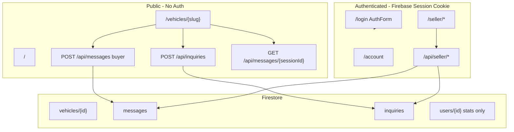
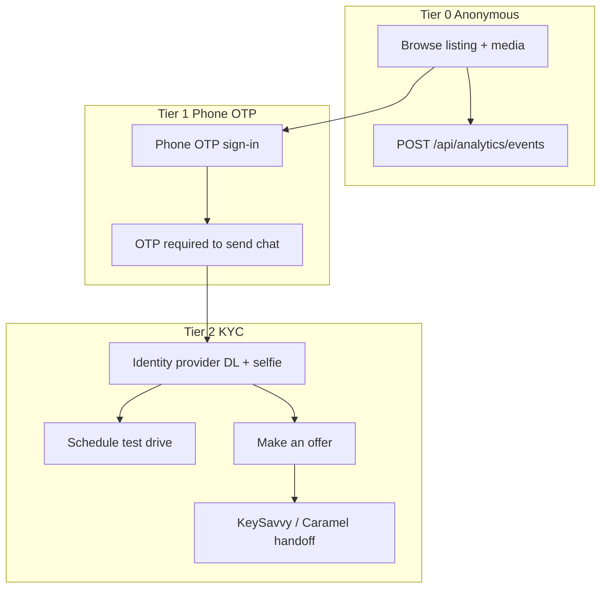
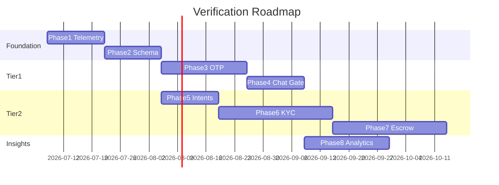

# Tiered Buyer Verification — Architectural Roadmap

**Project:** Sell By Owner Local (`sellbyownerlocal`)  
**Document date:** July 7, 2026  
**Status:** Planning — no verification tiers implemented yet  
**Companion doc:** [`DASHBOARD_MIGRATION.md`](DASHBOARD_MIGRATION.md) (seller dashboard Phases 1–4 complete)

---

## Executive Summary

The platform’s **recommended go-to-market posture** is a three-tier verification funnel:

| Tier | Friction | Buyer capability | Business value |
|------|----------|------------------|----------------|
| **0 — Anonymous** | None | Browse listings, photos, Monroney/build data, AI reconditioning content | Page views, photo engagement, top-of-funnel analytics |
| **1 — Phone OTP** | Low | Live chat with seller; optional verified contact identity | Blocks bots, VOIP, and international scam traffic on messaging |
| **2 — Full KYC** | High | Schedule test drive, make an offer, enter escrow | Trust premium for sellers; clean handoff to KeySavvy/Caramel AML flows |

**Today:** Tier 0 is largely implemented. Tiers 1 and 2 exist only in marketing copy (e.g. homepage “100% ID-verified transparency”). Auth is unified Firebase **email/password** for sellers; buyers can chat and submit inquiries **without any account**.

Each section below is **one implementation phase** — sized to become a single Cursor/agent plan.

---

## Current Architecture (As-Is)



### What works today (Tier 0)

| Capability | Implementation | Key paths |
|------------|----------------|-----------|
| Public listing SSR | No auth on `/vehicles/[id]` | `src/pages/vehicles/[id].astro`, `VehicleListingContent.astro` |
| Monroney / build sheet / docs | Public proxy APIs | `src/pages/api/vehicles/[vehicleId]/*` |
| Anonymous inquiries | IP rate limit (5 / 15 min) | `ContactForm.tsx`, `POST /api/inquiries` |
| Anonymous live chat | `localStorage` session ID + IP rate limit (20 / 15 min) | `ChatWidget.tsx`, `POST /api/messages` |
| Seller auth | HTTP-only `__session` cookie, 5-day expiry | `src/lib/auth.ts`, `POST /api/auth/session` |
| Seller dashboard | Inquiries + chat + listing editor | `SellerVehicleShell`, `ChatPanel`, `InquiriesPanel` |

### Critical gaps vs. tiered model

| Gap | Impact |
|-----|--------|
| No `verificationTier` on users or sessions | Cannot gate actions by trust level |
| Chat uses unguessable `sessionId` only — no buyer UID | Seller sees `Buyer {last4}`; no verified identity |
| No phone auth / OTP / VOIP filtering | Messaging is open to bots and scammers |
| No test-drive or make-offer flows | Nothing to trigger Tier 2 KYC |
| No KYC or escrow integrations | Cannot hand off to KeySavvy/Caramel |
| No engagement analytics (page views, photo swipes) | “De-anchoring data” for dealers not yet measurable |
| Marketing claims “ID-verified” without implementation | Trust/legal mismatch |
| `users/{uid}` not provisioned on signup | Profile is stats-only, seeded manually in dev |
| In-memory IP rate limits | Resets on deploy; not durable anti-abuse |

### Auth naming note

`requireSeller` / `SellerSession` in `src/lib/auth.ts` apply to **any** authenticated Firebase user — there is no separate buyer role yet. Future phases should introduce `BuyerSession`, `verificationTier`, and shared session helpers without breaking seller routes.

---

## Target Architecture (To-Be)



### Proposed verification tier enum

```typescript
// Future: src/schemas/index.ts
export const VerificationTierSchema = z.enum([
  'anonymous',      // Tier 0 — default, no account
  'phone_verified', // Tier 1 — OTP mobile confirmed, non-VOIP
  'identity_verified', // Tier 2 — KYC passed
]);
```

### Proposed buyer profile extension

```typescript
// Future: extend UserSchema or add buyers/{uid}
{
  displayName: string;
  phone?: string;              // E.164, verified at Tier 1
  phoneVerifiedAt?: string;    // ISO datetime
  verificationTier: VerificationTier;
  kyc?: {
    provider: 'stripe_identity' | 'persona' | 'keysavvy' | 'caramel';
    status: 'pending' | 'verified' | 'failed';
    verifiedAt?: string;
    externalId?: string;
  };
  stats: { averageRating; itemsSold }; // existing seller fields
}
```

---

## Phase Overview

| Phase | Name | Tier | Depends on |
|-------|------|------|------------|
| **1** | Anonymous Browse & Engagement Telemetry | 0 | — |
| **2** | Verification Schema & Auth Abstractions | Foundation | Phase 1 |
| **3** | Phone OTP Sign-In | 1 | Phase 2 |
| **4** | OTP-Gated Live Chat | 1 | Phase 3 |
| **5** | High-Stakes Action Framework | 2 (shell) | Phase 2 |
| **6** | KYC Identity Verification | 2 | Phase 5 |
| **7** | Escrow Partner Integration | 2 + transaction | Phase 6 |
| **8** | Seller Verified Analytics Dashboard | All tiers | Phases 1, 4, 6 |

---

## Phase 1 — Anonymous Browse & Engagement Telemetry

**Goal:** Preserve zero-friction public access while capturing the metrics needed for dealership “de-anchoring” narratives (page views, photo interactions).

**Entry criteria:** None (can start immediately).

### Scope

1. **Document and enforce Tier 0 surface area** — confirm these remain unauthenticated:
   - `/`, `/vehicles/{slug}`, vehicle document proxy APIs, inventory grid
2. **Add lightweight analytics event pipeline:**
   - New collection: `listing_events` (or BigQuery export later)
   - Events: `page_view`, `photo_view`, `carousel_swipe`, `section_view` (optional)
   - Payload: `{ vehicleId, eventType, timestamp, sessionId (anonymous cookie), referrer? }`
3. **Client instrumentation:**
   - SSR-safe anonymous session cookie (`anon_session`) if not present
   - `ImageCarousel`, hero image, `VehicleSectionNav` scroll milestones
4. **API:** `POST /api/analytics/events` — validate + rate limit; no PII required

### Key files (create / modify)

| Action | Path |
|--------|------|
| Create | `src/lib/analytics.ts`, `src/pages/api/analytics/events.ts` |
| Create | `src/schemas` — `ListingEventSchema` |
| Modify | `src/islands/ImageCarousel.tsx`, `VehicleListingContent.astro` |
| Modify | `src/lib/rate-limit.ts` (or move to Redis/Firestore counter in Phase 8) |

### Acceptance criteria

- [ ] Anonymous user can view full listing without login (regression test)
- [ ] Page view recorded once per listing per anon session per session window
- [ ] Carousel interaction events fire without blocking UI
- [ ] No buyer PII stored at Tier 0
- [ ] `npm run check && npm run build` pass

### Out of scope

- Seller-facing analytics UI (Phase 8)
- OTP or KYC

**Tier 0 public routes:** documented in [`docs/TIER0_PUBLIC_SURFACE.md`](docs/TIER0_PUBLIC_SURFACE.md).

---

## Phase 2 — Verification Schema & Auth Abstractions

**Goal:** Introduce data models and server helpers for verification tiers without changing buyer UX yet.

**Entry criteria:** Phase 1 complete (optional but recommended for session cookie pattern).

### Scope

1. **Extend schemas:**
   - `VerificationTierSchema`, `BuyerProfileSchema` (or extend `UserSchema`)
   - `MessageSchema` — optional `buyerUid`, `buyerPhoneLast4`
   - `InquirySchema` — optional `buyerUid`, `verificationTier` at submit time
2. **Firestore provisioning:**
   - On first authenticated login (any method), upsert `users/{uid}` with defaults
   - Migration script for existing Firebase users
3. **Auth library refactor:**
   - `getSession(request, cookies)` → `{ uid, email?, isDealer, verificationTier }`
   - `requireVerificationTier(tier, session)` helper
   - Keep backward-compatible `requireSeller` alias
4. **Account page:**
   - Show current verification tier badge (Anonymous / Phone verified / Identity verified)
   - Placeholder CTAs for “Verify phone” / “Verify identity” (wired in Phases 3 & 6)

### Key files

| Action | Path |
|--------|------|
| Modify | `src/schemas/index.ts` |
| Modify | `src/lib/auth.ts` |
| Modify | `src/pages/api/auth/session.ts` (attach tier from Firestore on session create) |
| Modify | `src/pages/account/index.astro` |
| Create | `src/lib/buyer-profile.ts` |
| Create | `scripts/backfill-user-profiles.ts` |

### Acceptance criteria

- [ ] New signup creates `users/{uid}` with `verificationTier: 'anonymous'` (or tier after phone in Phase 3)
- [ ] `requireVerificationTier('phone_verified')` returns 403 with structured error code
- [ ] Seller routes unchanged
- [ ] Zod schemas validate new fields; old documents still parse with defaults

### Out of scope

- SMS / OTP delivery
- Gating chat or inquiries

---

## Phase 3 — Phone OTP Sign-In

**Goal:** Implement Tier 1 identity — verified mobile number via OTP, with VOIP/high-risk number blocking.

**Entry criteria:** Phase 2 complete.

### Provider options (pick one in plan)

| Option | Pros | Cons |
|--------|------|------|
| **Firebase Phone Auth** | Already on stack; client SDK | VOIP blocking requires extra vendor (e.g. Twilio Lookup) |
| **Twilio Verify + custom token** | Strong fraud signals, Lookup API | More custom session wiring |
| **Stripe Identity (phone only)** | Unified with future KYC | Heavier integration |

**Recommendation:** Firebase Phone Auth for OTP UX + **Twilio Lookup v2** (or similar) server-side before sending code to reject VOIP/Google Voice.

### Scope

1. **New auth UI:** `PhoneOtpForm.tsx` island — phone input, send code, verify code
2. **API routes:**
   - `POST /api/auth/phone/send` — validate number, lookup line type, send OTP
   - `POST /api/auth/phone/verify` — confirm code, set `phoneVerifiedAt`, tier → `phone_verified`, issue session cookie
3. **Link phone to existing email account** (optional merge flow on `/account`)
4. **Firestore:** store `phone` (E.164), `phoneVerifiedAt`, `verificationTier`
5. **Homepage / listing CTAs:** “Sign in with phone to message seller” (copy only; gating in Phase 4)

### Key files

| Action | Path |
|--------|------|
| Create | `src/islands/PhoneOtpForm.tsx` |
| Create | `src/pages/api/auth/phone/send.ts`, `verify.ts` |
| Create | `src/lib/phone-verification.ts`, `src/lib/line-type-lookup.ts` |
| Modify | `src/islands/AuthForm.tsx` or `/login` — tab for phone vs email |
| Modify | `src/pages/index.astro` hero subtext (accurate tier language) |

### Acceptance criteria

- [ ] VOIP numbers rejected with user-friendly error
- [ ] Valid mobile receives OTP and completes sign-in
- [ ] Session cookie issued; `verificationTier === 'phone_verified'`
- [ ] Rate limits on send (per IP + per phone)
- [ ] Existing email/password seller login still works

### Out of scope

- Blocking chat until Phase 4
- Driver’s license KYC

---

## Phase 4 — OTP-Gated Live Chat

**Goal:** Require Tier 1 (`phone_verified`) before a buyer can **send** chat messages; preserve read-only chat preview or prompt-to-verify UX.

**Entry criteria:** Phase 3 complete.

### Scope

1. **API enforcement:**
   - `POST /api/messages` with `sender: 'buyer'` → `requireVerificationTier('phone_verified')`
   - Attach `buyerUid`, masked phone to message document
2. **ChatWidget UX:**
   - If not verified: show thread read-only + inline `PhoneOtpForm` or redirect to `/login?next=...`
   - After verify: resume same `vehicleId` context
3. **Seller ChatPanel:**
   - Display verified buyer as `Verified · ***-***-1234` instead of `Buyer {sessionId}`
   - Badge for `phone_verified` vs future `identity_verified`
4. **Session linking:**
   - Option A: retire anonymous `localStorage` session for sending; keep for analytics only
   - Option B: migrate anonymous session messages to UID on verify (nice-to-have)
5. **Security:** Remove buyer send reliance on IP-only rate limit as primary defense (keep as secondary)

### Key files

| Action | Path |
|--------|------|
| Modify | `src/pages/api/messages/index.ts` |
| Modify | `src/islands/ChatWidget.tsx` |
| Modify | `src/islands/seller/ChatPanel.tsx` |
| Modify | `src/lib/messages.ts`, `src/lib/chat-api.ts` |
| Modify | `firestore.indexes.json` (queries by `buyerUid` if needed) |

### Acceptance criteria

- [ ] Unauthenticated buyer cannot POST chat messages (403 + `VERIFICATION_REQUIRED`)
- [ ] Phone-verified buyer can send/receive via existing polling flow
- [ ] Seller sees verified phone mask on conversations
- [ ] Seller reply flow unchanged (auth + ownership)
- [ ] Homepage/marketing copy updated: messaging requires phone verification

### Policy decision (document in plan)

**Contact form (`POST /api/inquiries`):** Recommended to **keep anonymous** in Phase 4 (low-friction lead capture) but pre-fill from verified profile when logged in. Optional follow-up plan: gate inquiries behind OTP same as chat.

---

## Phase 5 — High-Stakes Action Framework

**Goal:** Introduce “Schedule Test Drive” and “Make an Offer” intents with server-side tier gates — UI and data model ready for KYC (Phase 6).

**Entry criteria:** Phase 2 complete (Phase 4 recommended so messaging funnel exists).

### Scope

1. **New Firestore collection:** `buyer_intents` — `{ type: 'test_drive' | 'offer', vehicleId, buyerUid, status, payload, createdAt }`
2. **Listing UI:** CTA buttons in contact section (alongside existing `ContactForm`)
3. **API routes:**
   - `POST /api/buyer/intents/test-drive`
   - `POST /api/buyer/intents/offer` (capture offer amount, message — no payment yet)
   - Both require auth; return `403 VERIFICATION_REQUIRED` if tier &lt; `identity_verified`
4. **Step-up modal:** “Verify your identity to continue” → launches Phase 6 KYC flow
5. **Seller dashboard:** new tab or inquiries sub-panel for test-drive / offer intents

### Key files

| Action | Path |
|--------|------|
| Create | `src/pages/api/buyer/intents/test-drive.ts`, `offer.ts` |
| Create | `src/islands/TestDriveButton.tsx`, `MakeOfferForm.tsx` |
| Modify | `VehicleListingContent.astro` contact section |
| Modify | `SellerVehicleShell` / new `IntentsPanel.tsx` |
| Modify | `src/schemas/index.ts` |

### Acceptance criteria

- [ ] CTAs visible to all; submit blocked until Tier 2 (with clear UX)
- [ ] Authenticated Tier 1 user sees step-up prompt, not opaque error
- [ ] Intent records appear in seller dashboard
- [ ] No payment or title transfer in this phase

---

## Phase 6 — KYC Identity Verification

**Goal:** Tier 2 — driver’s license + live selfie via a compliant identity provider.

**Entry criteria:** Phase 5 complete.

### Provider options

| Provider | Fit |
|----------|-----|
| **Stripe Identity** | Strong docs; pairs with future payments |
| **Persona** | Marketplace/KYC focus |
| **KeySavvy / Caramel embedded** | Aligns with Phase 7 escrow; may duplicate Phase 7 work |

**Recommendation:** Stripe Identity or Persona for in-app KYC; defer escrow-partner KYC to Phase 7 for payment-specific flows only.

### Scope

1. **API:**
   - `POST /api/buyer/kyc/session` — create provider verification session
   - `POST /api/buyer/kyc/webhook` — handle `verified` / `failed` events
   - Update `users/{uid}.verificationTier` → `identity_verified`
2. **UI:** `KycVerificationFlow.tsx` — embedded or redirect flow
3. **Unlock Phase 5 intents** on success
4. **Seller trust signals:** “Identity verified” badge on chat, intents, and optional public listing sidebar
5. **Audit:** store provider session ID; never store raw DL images in Firestore (provider holds PII)

### Key files

| Action | Path |
|--------|------|
| Create | `src/lib/kyc/` provider client + webhook verifier |
| Create | `src/pages/api/buyer/kyc/session.ts`, `webhook.ts` |
| Create | `src/islands/KycVerificationFlow.tsx` |
| Modify | `src/pages/account/index.astro` |
| Modify | `MakeOfferForm.tsx`, `TestDriveButton.tsx` |

### Acceptance criteria

- [ ] Successful KYC sets tier to `identity_verified`
- [ ] Failed KYC leaves tier at `phone_verified` with retry path
- [ ] Test drive / offer submission works after KYC
- [ ] Webhook signature verified; idempotent tier updates
- [ ] Marketing copy on homepage aligned with actual tiers

---

## Phase 7 — Escrow Partner Integration (KeySavvy / Caramel)

**Goal:** When a buyer initiates a **binding offer**, hand off to an escrow partner for AML/KYC, payment, and title — reuse partner KYC where possible.

**Entry criteria:** Phase 6 complete (or parallel if partner hosts all Tier 2 KYC).

### Scope

1. **Partner selection** — KeySavvy vs Caramel API evaluation (transaction create, buyer/seller invite, status webhooks)
2. **API:**
   - `POST /api/buyer/offers/{intentId}/escrow` — create partner transaction
   - `POST /api/webhooks/keysavvy` (or caramel) — sync status to `buyer_intents` / `offers`
3. **UI:** post-offer redirect to partner hosted flow
4. **Tier strategy:** If partner performs full KYC, map webhook → `identity_verified` and skip duplicate in-app KYC for that user
5. **Seller notification** when escrow milestone reached

### Key files

| Action | Path |
|--------|------|
| Create | `src/lib/escrow/` adapter interface + partner impl |
| Create | `src/pages/api/buyer/offers/[intentId]/escrow.ts` |
| Create | `src/pages/api/webhooks/escrow/[partner].ts` |
| Modify | `MakeOfferForm.tsx` success state |

### Acceptance criteria

- [ ] Offer intent creates partner transaction in sandbox
- [ ] Webhook updates local status
- [ ] Buyer redirected back with clear status on listing/account
- [ ] No card/bank data touches our servers (partner-hosted)

### Out of scope (future)

- Full closing workflow UI
- Seller payout configuration

---

## Phase 8 — Seller Verified Analytics Dashboard

**Goal:** Give sellers (and sponsoring dealers) **trustworthy funnel metrics** — anonymous views vs verified messages vs KYC-qualified intents.

**Entry criteria:** Phases 1, 4, and 6 minimally complete.

### Scope

1. **Aggregate metrics per vehicle:**
   - Page views, unique anon sessions (Phase 1)
   - Verified chat threads started / messages sent (Phase 4)
   - Test drives / offers requested; KYC conversion rate (Phases 5–6)
2. **Dashboard UI:** new “Insights” tab or section on `SellerVehicleShell`
3. **API:** `GET /api/seller/vehicles/[vehicleId]/analytics`
4. **Dealer narrative exports:** CSV or PDF snapshot for “12 page views, 0 offers — real local demand signal”
5. **Harden rate limiting:** move from in-memory to Firestore/Redis counters for production

### Key files

| Action | Path |
|--------|------|
| Create | `src/lib/listing-analytics.ts` |
| Create | `src/pages/api/seller/vehicles/[vehicleId]/analytics.ts` |
| Create | `src/islands/seller/InsightsPanel.tsx` |
| Modify | `SellerVehicleShell.tsx`, `SellerHeader.tsx` |

### Acceptance criteria

- [ ] Metrics match seeded events in dev
- [ ] Only vehicle owner can read analytics
- [ ] Dashboard distinguishes anonymous views from verified engagement
- [ ] Performance acceptable for listings with high event volume (pagination / rollups)

---

## Cross-Cutting Concerns

### Security & compliance

- **Firestore rules:** Not in repo today — each phase should add rules matching API auth (especially `messages`, `inquiries`, `users`, `listing_events`)
- **PII minimization:** Phone full number only in secure store; display masked; DL data never in Firestore
- **Marketing accuracy:** Update `index.astro` hero bullets after Phase 4+ to match real tiers
- **COPPA / consent:** Phone collection requires SMS disclosure and opt-in copy

### Existing code to preserve

| Area | Do not break |
|------|----------------|
| Seller dashboard | `/seller/*`, PATCH vehicle, document uploads |
| Public SSR listings | `/vehicles/{slug}` SEO URLs |
| Dealer flow | `dealer: true` claim, `/dealer/new` |
| Session cookies | `__session` pattern for SSR auth |

### Suggested implementation order



Phases 5 and 3–4 can overlap after Phase 2 if staffed in parallel.

---

## Appendix A — File Index (Current)

| Domain | Paths |
|--------|-------|
| Auth | `src/lib/auth.ts`, `src/lib/firebase-client.ts`, `src/islands/AuthForm.tsx`, `src/pages/api/auth/session.ts` |
| Public listing | `src/pages/vehicles/[id].astro`, `src/components/VehicleListingContent.astro` |
| Chat | `src/islands/ChatWidget.tsx`, `src/pages/api/messages/*`, `src/islands/seller/ChatPanel.tsx` |
| Inquiries | `src/islands/ContactForm.tsx`, `src/pages/api/inquiries/index.ts`, `InquiriesPanel.tsx` |
| Schemas | `src/schemas/index.ts` |
| Rate limit | `src/lib/rate-limit.ts` |
| Account | `src/pages/account/index.astro` |

---

## Appendix B — Open Product Decisions

Record decisions before starting Phase 3:

1. **Contact form tier:** Stay anonymous vs require phone OTP like chat?
2. **OTP provider:** Firebase Phone Auth + Twilio Lookup vs Twilio Verify end-to-end?
3. **KYC provider:** Stripe Identity vs Persona vs escrow-only KYC?
4. **Anonymous chat read:** Can unverified buyers read seller replies or only after OTP?
5. **International buyers:** Block non-US numbers at Tier 1?

---

## Appendix C — Success Metrics (PMF)

| Metric | Tier | Target narrative |
|--------|------|------------------|
| Listing page views | 0 | Top-of-funnel volume |
| Photo / carousel engagement | 0 | Serious shopper signal |
| Phone-verified chat starts | 1 | Bot-scrubbed conversations |
| KYC-qualified test drives / offers | 2 | High-intent, scam-free pipeline |
| View-to-offer ratio | 0 → 2 | Dealer de-anchoring proof |

---

*Each phase above is intended to map 1:1 to an implementation plan in Cursor. Start with Phase 1 unless product priority requires OTP (Phase 3) first.*
