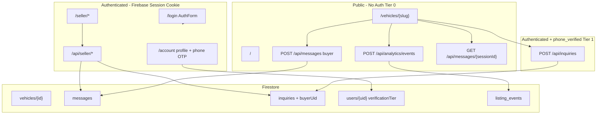
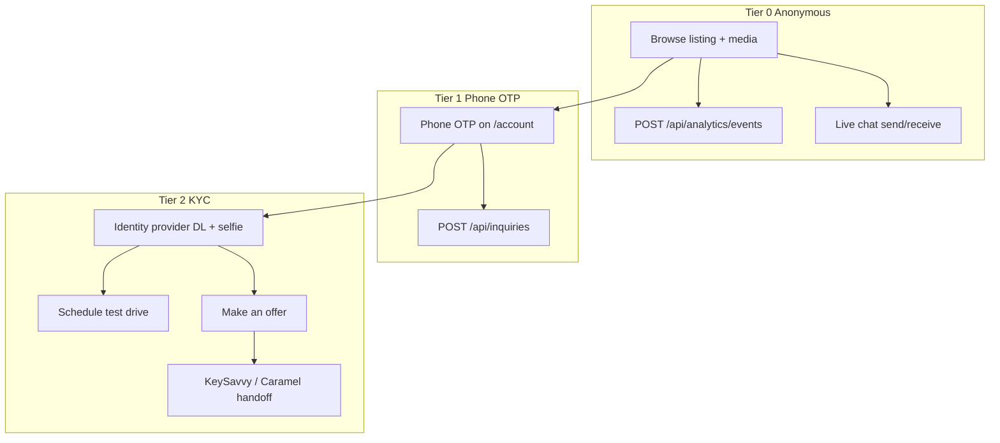
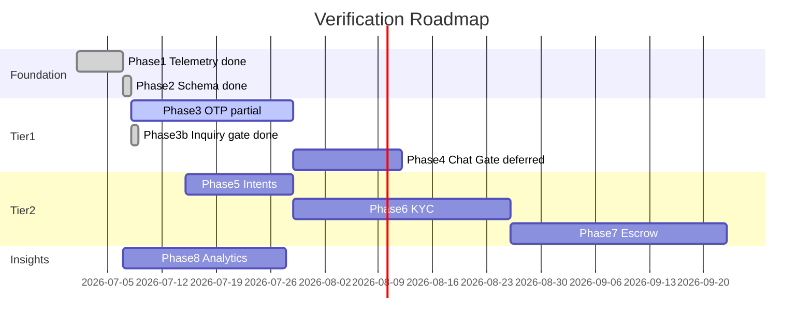

# Tiered Buyer Verification — Architectural Roadmap

**Project:** Sell By Owner Local (`sellbyownerlocal`)  
**Document date:** July 8, 2026  
**Status:** Phases 1–2 complete; Phase 3 partial; hybrid inquiry gating live (chat remains Tier 0)  
**Companion doc:** [`DASHBOARD_MIGRATION.md`](DASHBOARD_MIGRATION.md) (seller dashboard Phases 1–4 complete)  
**Tier 0 surface:** [`docs/TIER0_PUBLIC_SURFACE.md`](docs/TIER0_PUBLIC_SURFACE.md)

---

## Executive Summary

The platform’s **recommended go-to-market posture** is a three-tier verification funnel:

| Tier | Friction | Buyer capability | Business value |
|------|----------|------------------|----------------|
| **0 — Anonymous** | None | Browse listings, photos, Monroney/build data, AI reconditioning content, **live chat**, listing analytics | Page views, photo engagement, top-of-funnel analytics |
| **1 — Phone OTP** | Low | **Send seller inquiries** (contact form); verified profile on `/account` | Blocks bots on high-intent lead capture; optional identity for sellers |
| **2 — Full KYC** | High | Schedule test drive, make an offer, enter escrow | Trust premium for sellers; clean handoff to KeySavvy/Caramel AML flows |

**Today (July 8, 2026):** Tier 0 browsing, **anonymous live chat**, and listing analytics are live. Tier 1 phone OTP step-up is implemented on `/account` (`PhoneOtpForm` + `POST /api/auth/phone/verify`). **Inquiries are gated** behind `phone_verified` (`ContactForm` UX + `POST /api/inquiries` enforcement). **Live chat intentionally remains Tier 0** (hybrid policy). Tier 2 (full KYC), VOIP line-type filtering, and Phase 4 chat gating are not implemented.

Each section below is **one implementation phase** — sized to become a single Cursor/agent plan.

---

## Current Architecture (As-Is)



### What works today

| Capability | Tier | Implementation | Key paths |
|------------|------|----------------|-----------|
| Public listing SSR | 0 | No auth on `/vehicles/[slug]`; hybrid slug + canonical redirect | `src/pages/vehicles/[id].astro`, `src/utils/url-helpers.ts` |
| Monroney / build sheet / docs | 0 | Public proxy APIs | `src/pages/api/vehicles/[vehicleId]/*` |
| Anonymous listing analytics | 0 | `anon_session` cookie + `listing_events` | `src/middleware.ts`, `src/pages/api/analytics/events.ts`, `ListingAnalytics.tsx` |
| Anonymous live chat | 0 | `localStorage` session ID + IP rate limit (20 / 15 min) | `ChatWidget.tsx`, `POST /api/messages` |
| Email/password auth | — | HTTP-only `__session` cookie, 5-day expiry | `src/lib/auth.ts`, `POST /api/auth/session` |
| User profile provisioning | — | `users/{uid}` on session create; tier from Firestore | `src/lib/buyer-profile.ts`, `POST /api/auth/session` |
| Verification tier on session | — | `getSession` enriches with `verificationTier` | `src/lib/auth.ts` |
| Account page | 1 | Profile editor, tier badge, phone OTP step-up | `src/pages/account/index.astro`, `ProfileEditor.tsx`, `PhoneOtpAccountVerify.tsx` |
| Phone OTP (Tier 1) | 1 | Firebase Phone Auth + invisible reCAPTCHA; server tier upgrade | `PhoneOtpForm.tsx`, `POST /api/auth/phone/verify` |
| Gated inquiries | 1 | Session + `phone_verified` required | `ContactForm.tsx`, `POST /api/inquiries` |
| Seller dashboard | — | Inquiries + chat + listing editor | `SellerVehicleShell`, `ChatPanel`, `InquiriesPanel` |

### Remaining gaps

| Gap | Impact | Target phase |
|-----|--------|--------------|
| No VOIP / line-type filtering on phone OTP | Scam numbers may pass Tier 1 | Phase 3 follow-up |
| Chat uses unguessable `sessionId` only — no buyer UID on messages | Seller sees anonymous session label | Phase 4 (if chat gating is adopted) |
| No test-drive or make-offer flows | Nothing to trigger Tier 2 KYC | Phase 5 |
| No KYC or escrow integrations | Cannot hand off to KeySavvy/Caramel | Phases 6–7 |
| No seller-facing analytics dashboard | Dealers cannot see funnel metrics in UI | Phase 8 |
| In-memory IP rate limits | Resets on deploy; not durable anti-abuse | Phase 8 |
| Firestore security rules not in repo | API-only auth today | Cross-cutting |
| Marketing “ID-verified” claims | Tier 2 not live; copy may overstate | Ongoing |

### Auth naming note

`requireSeller` / `SellerSession` in `src/lib/auth.ts` apply to **any** authenticated Firebase user — there is no separate buyer role yet. `UserSession` and `requireVerificationTier` are implemented; `SellerSession` remains a backward-compatible alias.

---

## Target Architecture (To-Be)

**Hybrid policy (implemented):** Inquiries require Tier 1; live chat stays Tier 0. Phase 4 chat gating is **deferred** unless product reverses this decision.



### Verification tier enum (implemented)

```typescript
// src/schemas/index.ts
export const VerificationTierSchema = z.enum([
  'anonymous',         // Tier 0 — default at signup
  'phone_verified',    // Tier 1 — OTP mobile linked via Firebase
  'identity_verified', // Tier 2 — KYC passed (not yet available)
]);
```

### Buyer profile fields (implemented)

```typescript
// src/schemas/index.ts — UserSchema
{
  displayName: string;
  stats: { averageRating: number; itemsSold: number };
  verificationTier: VerificationTier;
  phone?: string;              // E.164, set at Tier 1
  phoneVerifiedAt?: string;    // ISO datetime
  kyc?: {
    provider: 'stripe_identity' | 'persona' | 'keysavvy' | 'caramel';
    status: 'pending' | 'verified' | 'failed';
    verifiedAt?: string;
    externalId?: string;
  };
}
```

---

## Phase Overview

| Phase | Name | Tier | Status | Depends on |
|-------|------|------|--------|------------|
| **1** | Anonymous Browse & Engagement Telemetry | 0 | **Complete** | — |
| **2** | Verification Schema & Auth Abstractions | Foundation | **Complete** | Phase 1 |
| **3** | Phone OTP Sign-In | 1 | **Partial** | Phase 2 |
| **3b** | Inquiry Gating (hybrid) | 1 | **Complete** | Phase 3 (core OTP) |
| **4** | OTP-Gated Live Chat | 1 | **Deferred** | Phase 3 — chat stays Tier 0 by policy |
| **5** | High-Stakes Action Framework | 2 (shell) | Not started | Phase 2 |
| **6** | KYC Identity Verification | 2 | Not started | Phase 5 |
| **7** | Escrow Partner Integration | 2 + transaction | Not started | Phase 6 |
| **8** | Seller Verified Analytics Dashboard | All tiers | Not started | Phases 1, 4, 6 |

---

## Phase 1 — Anonymous Browse & Engagement Telemetry

**Status:** Complete (July 2026)

**Goal:** Preserve zero-friction public access while capturing the metrics needed for dealership “de-anchoring” narratives (page views, photo interactions).

**Entry criteria:** None (can start immediately).

### Scope

1. **Document and enforce Tier 0 surface area** — confirm these remain unauthenticated:
   - `/`, `/vehicles/{slug}`, vehicle document proxy APIs, inventory grid
2. **Add lightweight analytics event pipeline:**
   - New collection: `listing_events` (or BigQuery export later)
   - Events: `page_view`, `photo_view`, `carousel_swipe`, `section_view` (optional)
   - Payload: `{ vehicleId, eventType, timestamp, sessionId (anonymous cookie), referrer? }`
3. **Client instrumentation:**
   - SSR-safe anonymous session cookie (`anon_session`) if not present
   - `ImageCarousel`, hero image, `VehicleSectionNav` scroll milestones
4. **API:** `POST /api/analytics/events` — validate + rate limit; no PII required

### Key files (create / modify)

| Action | Path | Done |
|--------|------|------|
| Create | `src/lib/analytics.ts`, `src/lib/analytics-session.ts`, `src/pages/api/analytics/events.ts` | Yes |
| Create | `src/middleware.ts` — scoped `anon_session` cookie | Yes |
| Create | `src/lib/listing-analytics-client.ts`, `src/islands/ListingAnalytics.tsx` | Yes |
| Create | `src/schemas` — `ListingEventSchema` | Yes |
| Modify | `src/islands/ImageCarousel.tsx`, `VehicleListingContent.astro` | Yes |
| Create | `docs/TIER0_PUBLIC_SURFACE.md` | Yes |
| Modify | `firestore.indexes.json` — `listing_events` composite index | Yes |

### Acceptance criteria

- [x] Anonymous user can view full listing without login (regression test)
- [x] Page view recorded once per listing per anon session per session window
- [x] Carousel interaction events fire without blocking UI
- [x] No buyer PII stored at Tier 0
- [x] `npm run check && npm run build` pass

### Out of scope

- Seller-facing analytics UI (Phase 8)
- OTP or KYC

**Tier 0 public routes:** documented in [`docs/TIER0_PUBLIC_SURFACE.md`](docs/TIER0_PUBLIC_SURFACE.md).

---

## Phase 2 — Verification Schema & Auth Abstractions

**Status:** Complete (July 2026)

**Goal:** Introduce data models and server helpers for verification tiers without changing buyer UX yet.

**Entry criteria:** Phase 1 complete (optional but recommended for session cookie pattern).

### Scope

1. **Extend schemas:**
   - `VerificationTierSchema`, `BuyerProfileSchema` (or extend `UserSchema`)
   - `MessageSchema` — optional `buyerUid`, `buyerPhoneLast4`
   - `InquirySchema` — optional `buyerUid`, `verificationTier` at submit time
2. **Firestore provisioning:**
   - On first authenticated login (any method), upsert `users/{uid}` with defaults
   - Migration script for existing Firebase users
3. **Auth library refactor:**
   - `getSession(request, cookies)` → `{ uid, email?, isDealer, verificationTier }`
   - `requireVerificationTier(tier, session)` helper
   - Keep backward-compatible `requireSeller` alias
4. **Account page:**
   - Show current verification tier badge (Anonymous / Phone verified / Identity verified)
   - Placeholder CTAs for “Verify phone” / “Verify identity” (wired in Phases 3 & 6)

### Key files

| Action | Path | Done |
|--------|------|------|
| Modify | `src/schemas/index.ts` | Yes |
| Modify | `src/lib/auth.ts` | Yes |
| Modify | `src/pages/api/auth/session.ts` (provision profile on session create) | Yes |
| Modify | `src/pages/api/users/[id].ts` (`PublicUserResponseSchema`) | Yes |
| Modify | `src/pages/account/index.astro` | Yes |
| Create | `src/lib/buyer-profile.ts` | Yes |
| Create | `src/components/VerificationTierBadge.astro` | Yes |
| Create | `scripts/backfill-user-profiles.ts` | Yes |

### Acceptance criteria

- [x] New signup creates `users/{uid}` with `verificationTier: 'anonymous'`
- [x] `requireVerificationTier('phone_verified')` returns 403 with structured error code
- [x] Seller routes unchanged
- [x] Zod schemas validate new fields; old documents still parse with defaults

### Out of scope

- SMS / OTP delivery
- Gating chat or inquiries

---

## Phase 3 — Phone OTP Sign-In

**Status:** Partial (July 2026) — core OTP + account UX shipped; VOIP lookup and standalone phone login not done

**Goal:** Implement Tier 1 identity — verified mobile number via OTP.

**Entry criteria:** Phase 2 complete.

### Provider options (pick one in plan)

| Option | Pros | Cons |
|--------|------|------|
| **Firebase Phone Auth** | Already on stack; client SDK | VOIP blocking requires extra vendor (e.g. Twilio Lookup) |
| **Twilio Verify + custom token** | Strong fraud signals, Lookup API | More custom session wiring |
| **Stripe Identity (phone only)** | Unified with future KYC | Heavier integration |

**Chosen provider:** Firebase Phone Auth (client SDK + invisible reCAPTCHA). Server confirms via `POST /api/auth/phone/verify` after `linkWithPhoneNumber` on existing email account.

**Not yet implemented:** Twilio Lookup VOIP rejection, `POST /api/auth/phone/send` (SMS sent client-side), phone-only sign-in tab on `/login`.

### Scope

1. **Auth UI:** `PhoneOtpForm.tsx` — phone input, invisible reCAPTCHA, OTP verify — **done**
2. **Account wrapper:** `PhoneOtpAccountVerify.tsx` calls server after OTP — **done**
3. **API:** `POST /api/auth/phone/verify` — verify idToken, set `phone`, `phoneVerifiedAt`, tier → `phone_verified` — **done**
4. **Profile editor:** `ProfileEditor.tsx` + `PATCH /api/users/[id]` for `displayName` — **done**
5. **Link phone to existing email account** via `linkWithPhoneNumber` on `/account` — **done**
6. **VOIP / line-type lookup** before send — **not done**
7. **Phone tab on `/login`** — **not done**

### Key files

| Action | Path | Done |
|--------|------|------|
| Create | `src/islands/PhoneOtpForm.tsx` | Yes |
| Create | `src/islands/PhoneOtpAccountVerify.tsx` | Yes |
| Create | `src/pages/api/auth/phone/verify.ts` | Yes |
| Create | `src/islands/buyer/ProfileEditor.tsx` | Yes |
| Modify | `src/pages/api/users/[id].ts` — PATCH displayName | Yes |
| Modify | `src/pages/account/index.astro` | Yes |
| Create | `src/lib/phone-verification.ts`, `src/lib/line-type-lookup.ts` | No |
| Create | `src/pages/api/auth/phone/send.ts` | No (client sends SMS) |

### Acceptance criteria

- [ ] VOIP numbers rejected with user-friendly error
- [x] Valid mobile receives OTP and completes verification on `/account`
- [x] Firestore `verificationTier === 'phone_verified'` after server verify
- [ ] Rate limits on send (per IP + per phone) beyond Firebase defaults
- [x] Existing email/password seller login still works

### Out of scope (completed elsewhere)

- Inquiry gating — see Phase 3b below
- Driver’s license KYC — Phase 6

---

## Phase 3b — Inquiry Gating (Hybrid Policy)

**Status:** Complete (July 2026)

**Goal:** Gate seller inquiries behind Tier 1 while keeping live chat anonymous (Tier 0).

### Scope

1. **API:** `POST /api/inquiries` requires session + `requireVerificationTier('phone_verified')`; stores `buyerUid`, `verificationTier` — **done**
2. **UI:** `ContactForm.tsx` — logged-out CTA, anonymous overlay with verify-phone link, prefill from profile — **done**
3. **SSR:** `vehicles/[id].astro` passes `buyerContext` to listing — **done**
4. **Chat:** `ChatWidget.tsx` and buyer `POST /api/messages` unchanged — **done**

### Key files

| Action | Path | Done |
|--------|------|------|
| Modify | `src/pages/api/inquiries/index.ts` | Yes |
| Modify | `src/islands/ContactForm.tsx` | Yes |
| Modify | `src/components/VehicleListingContent.astro` | Yes |
| Modify | `src/pages/vehicles/[id].astro` | Yes |

### Acceptance criteria

- [x] Unauthenticated user cannot submit inquiry (401 / login CTA)
- [x] Logged-in `anonymous` tier sees verify-phone prompt; cannot submit
- [x] `phone_verified` user can submit inquiry
- [x] Anonymous buyer chat still works without login

---

## Phase 4 — OTP-Gated Live Chat

**Status:** Deferred — hybrid policy keeps chat at Tier 0

**Goal:** ~~Require Tier 1 (`phone_verified`) before a buyer can **send** chat messages~~ **Not adopted.** Product decision: inquiries are gated (Phase 3b); chat remains anonymous for lowest friction.

**Entry criteria:** N/A unless policy changes.

### Scope

1. **API enforcement:**
   - `POST /api/messages` with `sender: 'buyer'` → `requireVerificationTier('phone_verified')`
   - Attach `buyerUid`, masked phone to message document
2. **ChatWidget UX:**
   - If not verified: show thread read-only + inline `PhoneOtpForm` or redirect to `/login?next=...`
   - After verify: resume same `vehicleId` context
3. **Seller ChatPanel:**
   - Display verified buyer as `Verified · ***-***-1234` instead of `Buyer {sessionId}`
   - Badge for `phone_verified` vs future `identity_verified`
4. **Session linking:**
   - Option A: retire anonymous `localStorage` session for sending; keep for analytics only
   - Option B: migrate anonymous session messages to UID on verify (nice-to-have)
5. **Security:** Remove buyer send reliance on IP-only rate limit as primary defense (keep as secondary)

### Key files

| Action | Path |
|--------|------|
| Modify | `src/pages/api/messages/index.ts` |
| Modify | `src/islands/ChatWidget.tsx` |
| Modify | `src/islands/seller/ChatPanel.tsx` |
| Modify | `src/lib/messages.ts`, `src/lib/chat-api.ts` |
| Modify | `firestore.indexes.json` (queries by `buyerUid` if needed) |

### Acceptance criteria

- [ ] Unauthenticated buyer cannot POST chat messages (403 + `VERIFICATION_REQUIRED`)
- [ ] Phone-verified buyer can send/receive via existing polling flow
- [ ] Seller sees verified phone mask on conversations
- [ ] Seller reply flow unchanged (auth + ownership)
- [ ] Homepage/marketing copy updated: messaging requires phone verification

### Policy decision (recorded)

**Contact form (`POST /api/inquiries`):** **Gated behind `phone_verified`** (implemented in Phase 3b).  
**Live chat (`POST /api/messages` buyer):** **Remains anonymous** (Tier 0). Do not add `requireVerificationTier` to buyer message flow unless product reverses this decision.

---

## Phase 5 — High-Stakes Action Framework

**Goal:** Introduce “Schedule Test Drive” and “Make an Offer” intents with server-side tier gates — UI and data model ready for KYC (Phase 6).

**Entry criteria:** Phase 2 complete (Phase 4 recommended so messaging funnel exists).

### Scope

1. **New Firestore collection:** `buyer_intents` — `{ type: 'test_drive' | 'offer', vehicleId, buyerUid, status, payload, createdAt }`
2. **Listing UI:** CTA buttons in contact section (alongside existing `ContactForm`)
3. **API routes:**
   - `POST /api/buyer/intents/test-drive`
   - `POST /api/buyer/intents/offer` (capture offer amount, message — no payment yet)
   - Both require auth; return `403 VERIFICATION_REQUIRED` if tier &lt; `identity_verified`
4. **Step-up modal:** “Verify your identity to continue” → launches Phase 6 KYC flow
5. **Seller dashboard:** new tab or inquiries sub-panel for test-drive / offer intents

### Key files

| Action | Path |
|--------|------|
| Create | `src/pages/api/buyer/intents/test-drive.ts`, `offer.ts` |
| Create | `src/islands/TestDriveButton.tsx`, `MakeOfferForm.tsx` |
| Modify | `VehicleListingContent.astro` contact section |
| Modify | `SellerVehicleShell` / new `IntentsPanel.tsx` |
| Modify | `src/schemas/index.ts` |

### Acceptance criteria

- [ ] CTAs visible to all; submit blocked until Tier 2 (with clear UX)
- [ ] Authenticated Tier 1 user sees step-up prompt, not opaque error
- [ ] Intent records appear in seller dashboard
- [ ] No payment or title transfer in this phase

---

## Phase 6 — KYC Identity Verification

**Goal:** Tier 2 — driver’s license + live selfie via a compliant identity provider.

**Entry criteria:** Phase 5 complete.

### Provider options

| Provider | Fit |
|----------|-----|
| **Stripe Identity** | Strong docs; pairs with future payments |
| **Persona** | Marketplace/KYC focus |
| **KeySavvy / Caramel embedded** | Aligns with Phase 7 escrow; may duplicate Phase 7 work |

**Recommendation:** Stripe Identity or Persona for in-app KYC; defer escrow-partner KYC to Phase 7 for payment-specific flows only.

### Scope

1. **API:**
   - `POST /api/buyer/kyc/session` — create provider verification session
   - `POST /api/buyer/kyc/webhook` — handle `verified` / `failed` events
   - Update `users/{uid}.verificationTier` → `identity_verified`
2. **UI:** `KycVerificationFlow.tsx` — embedded or redirect flow
3. **Unlock Phase 5 intents** on success
4. **Seller trust signals:** “Identity verified” badge on chat, intents, and optional public listing sidebar
5. **Audit:** store provider session ID; never store raw DL images in Firestore (provider holds PII)

### Key files

| Action | Path |
|--------|------|
| Create | `src/lib/kyc/` provider client + webhook verifier |
| Create | `src/pages/api/buyer/kyc/session.ts`, `webhook.ts` |
| Create | `src/islands/KycVerificationFlow.tsx` |
| Modify | `src/pages/account/index.astro` |
| Modify | `MakeOfferForm.tsx`, `TestDriveButton.tsx` |

### Acceptance criteria

- [ ] Successful KYC sets tier to `identity_verified`
- [ ] Failed KYC leaves tier at `phone_verified` with retry path
- [ ] Test drive / offer submission works after KYC
- [ ] Webhook signature verified; idempotent tier updates
- [ ] Marketing copy on homepage aligned with actual tiers

---

## Phase 7 — Escrow Partner Integration (KeySavvy / Caramel)

**Goal:** When a buyer initiates a **binding offer**, hand off to an escrow partner for AML/KYC, payment, and title — reuse partner KYC where possible.

**Entry criteria:** Phase 6 complete (or parallel if partner hosts all Tier 2 KYC).

### Scope

1. **Partner selection** — KeySavvy vs Caramel API evaluation (transaction create, buyer/seller invite, status webhooks)
2. **API:**
   - `POST /api/buyer/offers/{intentId}/escrow` — create partner transaction
   - `POST /api/webhooks/keysavvy` (or caramel) — sync status to `buyer_intents` / `offers`
3. **UI:** post-offer redirect to partner hosted flow
4. **Tier strategy:** If partner performs full KYC, map webhook → `identity_verified` and skip duplicate in-app KYC for that user
5. **Seller notification** when escrow milestone reached

### Key files

| Action | Path |
|--------|------|
| Create | `src/lib/escrow/` adapter interface + partner impl |
| Create | `src/pages/api/buyer/offers/[intentId]/escrow.ts` |
| Create | `src/pages/api/webhooks/escrow/[partner].ts` |
| Modify | `MakeOfferForm.tsx` success state |

### Acceptance criteria

- [ ] Offer intent creates partner transaction in sandbox
- [ ] Webhook updates local status
- [ ] Buyer redirected back with clear status on listing/account
- [ ] No card/bank data touches our servers (partner-hosted)

### Out of scope (future)

- Full closing workflow UI
- Seller payout configuration

---

## Phase 8 — Seller Verified Analytics Dashboard

**Goal:** Give sellers (and sponsoring dealers) **trustworthy funnel metrics** — anonymous views vs verified messages vs KYC-qualified intents.

**Entry criteria:** Phases 1, 4, and 6 minimally complete.

### Scope

1. **Aggregate metrics per vehicle:**
   - Page views, unique anon sessions (Phase 1)
   - Verified chat threads started / messages sent (Phase 4)
   - Test drives / offers requested; KYC conversion rate (Phases 5–6)
2. **Dashboard UI:** new “Insights” tab or section on `SellerVehicleShell`
3. **API:** `GET /api/seller/vehicles/[vehicleId]/analytics`
4. **Dealer narrative exports:** CSV or PDF snapshot for “12 page views, 0 offers — real local demand signal”
5. **Harden rate limiting:** move from in-memory to Firestore/Redis counters for production

### Key files

| Action | Path |
|--------|------|
| Create | `src/lib/listing-analytics.ts` |
| Create | `src/pages/api/seller/vehicles/[vehicleId]/analytics.ts` |
| Create | `src/islands/seller/InsightsPanel.tsx` |
| Modify | `SellerVehicleShell.tsx`, `SellerHeader.tsx` |

### Acceptance criteria

- [ ] Metrics match seeded events in dev
- [ ] Only vehicle owner can read analytics
- [ ] Dashboard distinguishes anonymous views from verified engagement
- [ ] Performance acceptable for listings with high event volume (pagination / rollups)

---

## Cross-Cutting Concerns

### Security & compliance

- **Firestore rules:** Not in repo today — each phase should add rules matching API auth (especially `messages`, `inquiries`, `users`, `listing_events`)
- **PII minimization:** Phone full number only in secure store; display masked; DL data never in Firestore
- **Marketing accuracy:** Homepage hero updated for tier language; Tier 2 “ID-verified” claims should remain disabled until Phase 6
- **COPPA / consent:** Phone collection requires SMS disclosure and opt-in copy

### Existing code to preserve

| Area | Do not break |
|------|----------------|
| Seller dashboard | `/seller/*`, PATCH vehicle, document uploads |
| Public SSR listings | `/vehicles/{slug}` SEO URLs |
| Dealer flow | `dealer: true` claim, `/dealer/new` |
| Session cookies | `__session` pattern for SSR auth |

### Suggested implementation order

Phases 1, 2, and 3b are **complete**. Phase 3 VOIP follow-up, Phase 5 (intents), and Phase 8 (seller dashboard) are the highest-value next steps. Phase 4 is **deferred** (chat stays Tier 0).



---

## Appendix A — File Index

| Domain | Paths |
|--------|-------|
| Auth | `src/lib/auth.ts`, `src/lib/buyer-profile.ts`, `src/lib/firebase-client.ts`, `src/islands/AuthForm.tsx`, `src/pages/api/auth/session.ts`, `src/pages/api/auth/phone/verify.ts` |
| Account / Tier 1 | `src/pages/account/index.astro`, `src/islands/buyer/ProfileEditor.tsx`, `src/islands/PhoneOtpForm.tsx`, `src/islands/PhoneOtpAccountVerify.tsx`, `src/components/VerificationTierBadge.astro` |
| Public listing | `src/pages/vehicles/[id].astro`, `src/components/VehicleListingContent.astro`, `src/utils/url-helpers.ts` |
| Analytics (Tier 0) | `src/middleware.ts`, `src/lib/analytics-session.ts`, `src/lib/analytics.ts`, `src/lib/listing-analytics-client.ts`, `src/islands/ListingAnalytics.tsx`, `src/pages/api/analytics/events.ts` |
| Chat (Tier 0) | `src/islands/ChatWidget.tsx`, `src/pages/api/messages/*`, `src/islands/seller/ChatPanel.tsx` |
| Inquiries (Tier 1 gated) | `src/islands/ContactForm.tsx`, `src/pages/api/inquiries/index.ts`, `InquiriesPanel.tsx` |
| Schemas | `src/schemas/index.ts` |
| Rate limit | `src/lib/rate-limit.ts` |
| Docs | `docs/TIER0_PUBLIC_SURFACE.md`, `scripts/backfill-user-profiles.ts` |

---

## Appendix B — Product Decisions (Recorded)

| # | Decision | Outcome | Date |
|---|----------|---------|------|
| 1 | **Contact form tier** | Gate behind `phone_verified` (not anonymous) | July 2026 |
| 2 | **Chat tier** | Keep anonymous (Tier 0); defer Phase 4 chat gating | July 2026 |
| 3 | **OTP provider** | Firebase Phone Auth + invisible reCAPTCHA; server verify via idToken | July 2026 |
| 4 | **VOIP filtering** | Not yet implemented; Twilio Lookup deferred | — |
| 5 | **KYC provider** | Stripe Identity vs Persona vs escrow-only — TBD | — |
| 6 | **Anonymous chat read** | Unverified buyers can read/send chat without login | July 2026 |
| 7 | **International buyers** | US E.164 (+1) assumed in `PhoneOtpForm`; non-US TBD | — |

---

## Appendix C — Success Metrics (PMF)

| Metric | Tier | Target narrative | Status |
|--------|------|------------------|--------|
| Listing page views | 0 | Top-of-funnel volume | Collecting (`listing_events`) |
| Photo / carousel engagement | 0 | Serious shopper signal | Collecting |
| Phone-verified inquiries | 1 | Bot-scrubbed lead capture | Gated + trackable via `buyerUid` |
| Phone-verified chat starts | 1 | Bot-scrubbed conversations | N/A — chat not gated |
| KYC-qualified test drives / offers | 2 | High-intent, scam-free pipeline | Not started |
| View-to-offer ratio | 0 → 2 | Dealer de-anchoring proof | Phase 8 dashboard |

---

## Next recommended work

1. **Phase 3 follow-up:** Twilio Lookup (or equivalent) VOIP rejection before OTP send
2. **Phase 5:** Test drive / make-offer intent framework with Tier 2 gates
3. **Phase 8:** Seller analytics dashboard consuming `listing_events` + inquiry/chat funnel (chat remains anonymous in metrics)

*Phases 1–2 and hybrid inquiry gating (3b) are complete. Phase 4 chat gating is deferred by product policy.*
