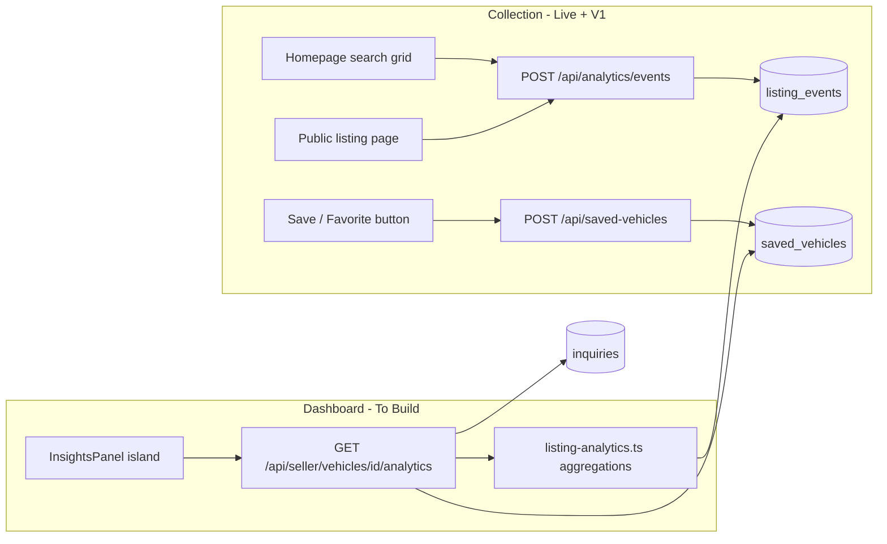
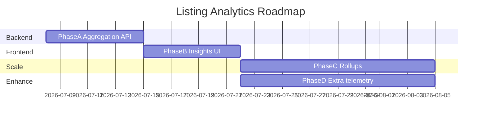

# Seller Listing Analytics — Roadmap

**Project:** Sell By Owner Local (`sellbyownerlocal`)  
**Document date:** July 8, 2026  
**Status:** Planning — listing-detail telemetry live; v1 adds impressions, dwell time, saves, and seller Insights dashboard  
**Prerequisite:** Verification Phase 1 (anonymous telemetry) complete; Phone OTP + inquiry gating live  
**Companion docs:** [`VERIFICATION_ROADMAP.md`](VERIFICATION_ROADMAP.md), [`docs/TIER0_PUBLIC_SURFACE.md`](docs/TIER0_PUBLIC_SURFACE.md)

---

## Executive Summary

Sellers need **actionable pricing intelligence** across the full intent funnel — from search grid visibility through listing engagement to verified inquiries and saves. Buyers already generate anonymous engagement events on public listings; v1 completes top-of-funnel telemetry (impressions, CTR, dwell time) and logged-in saves, then delivers a **Seller Insights** experience in the dashboard — **without** waiting for verified-buyer funnel analytics (chat remains Tier 0; KYC is future work).

**Core question the dashboard answers:**

> “Is my listing getting seen, clicked, and read deeply enough to justify my price — and are shoppers saving it as a price watcher?”

**Not in scope for v1:** Verified vs anonymous buyer breakdown, per-buyer save identities exposed to seller, KYC-qualified intent funnels (see VERIFICATION_ROADMAP Phase 8 follow-up).

---

## What We Collect Today (Phase 1 — Complete)

### Event pipeline

| Layer | Implementation |
|-------|----------------|
| Anonymous session | `anon_session` httpOnly cookie via [`src/middleware.ts`](src/middleware.ts) (scoped to `/`, `/vehicles/*`, `/api/analytics/events`) |
| Client instrumentation | [`ListingAnalytics.tsx`](src/islands/ListingAnalytics.tsx), [`ImageCarousel.tsx`](src/islands/ImageCarousel.tsx) |
| Client helper | [`src/lib/listing-analytics-client.ts`](src/lib/listing-analytics-client.ts) — `sessionStorage` dedupe + `fetch` to API |
| API | `POST /api/analytics/events` — Zod validation, IP rate limit, page-view dedupe per session/vehicle/24h |
| Storage | Firestore `listing_events` — `{ sessionId, vehicleId, eventType, metadata, timestamp }` |
| Index | `vehicleId + eventType + timestamp` ([`firestore.indexes.json`](firestore.indexes.json)) |
| Exclusions | Seller preview (`analyticsEnabled={false}`); seller-owned sessions excluded from impression/CTR in v1 aggregation (see Phase A) |

### Event types (`ListingEventTypeSchema`)

**Live today (listing detail page):**

| Event | When fired | Metadata | Seller meaning |
|-------|------------|----------|----------------|
| `page_view` | Once per browser tab session per listing | — | **Listing visit** (deduped client + server) |
| `section_view` | First time a nav section enters viewport (IntersectionObserver) | `sectionId` | **Scroll depth / interest areas** |
| `photo_view` | Hero (once) or gallery/carousel photo seen | `photoIndex`, `surface` | **Visual engagement** |
| `carousel_swipe` | User swipes carousel | `photoIndex`, `surface` | **Active photo browsing** |

**V1 additions (Phase A/B — completes intent funnel):**

| Event | When fired | Metadata | Seller meaning |
|-------|------------|----------|----------------|
| `impression` | Search grid card ≥50% visible (IntersectionObserver on [`VehicleCard.tsx`](src/components/buyer/VehicleCard.tsx) / homepage grid) | `rank`, `position`, `surface: 'search_grid'` | **Top-of-funnel visibility** in inventory |
| `page_leave` | `visibilitychange` (hidden) or `pagehide` / `beforeunload` beacon on listing page | `durationMs` (optional client-computed) | **Dwell time** — session length on listing |
| `save_vehicle` | Logged-in buyer taps Save/Favorite (Tier 1+ account required) | — | **Price watcher** — active save on vehicle |

**Collection notes:**

- `impression` deduped once per `sessionId` + `vehicleId` per page load (same pattern as `page_view`).
- `page_leave` paired with `page_view` by `sessionId` + `vehicleId` to compute dwell time; use `sendBeacon` / `keepalive` fetch for reliability on tab close.
- `save_vehicle` stored in `saved_vehicles` (or `listing_events` with `buyerUid`); aggregate **active saves** count for seller dashboard — not anonymous.

### Tracked sections (via `navSections` in listing view)

Examples: `overview`, `walkaround`, `pitch`, `gallery`, `maintenance`, `market`, `features`, `specs`, `contact`, `build-sheet`, `carfax`, `kbb`, `smog`, etc. — varies per vehicle.

### Related signals (not in `listing_events` — optional v1 supplements)

| Signal | Source | Use in insights |
|--------|--------|-----------------|
| Inquiry count | `inquiries` collection (`vehicleId`, `timestamp`) | High-intent lead (Tier 1 `phone_verified` since July 2026) |
| Active saves | `saved_vehicles` collection (`vehicleId`, `buyerUid`, `savedAt`) | **Price watchers** — logged-in buyers favoriting listing |
| Chat threads | `messages` collection | Volume indicator; anonymous — no buyer identity |
| Listing age / price changes | `vehicles` document | Context for trend interpretation |

---

## Metric Definitions (Seller-Facing)

Use plain language in UI; define precisely in API.

| Metric | Definition | Query approach |
|--------|------------|----------------|
| **Search impressions** | Count of `impression` events on search grid | `COUNT WHERE eventType = impression` |
| **Click-through rate (CTR)** | `(Unique page_views / Impressions) × 100` | Distinct `sessionId` on `page_view` ÷ impression count; cap at 100% |
| **Total page views** | Count of `page_view` events | `COUNT WHERE eventType = page_view` |
| **Unique visitors** | Distinct `sessionId` with ≥1 `page_view` | `COUNT DISTINCT sessionId` on page_views |
| **Dwell time** | Average duration between `page_view` and `page_leave` per session | Match by `sessionId` + `vehicleId`; mean of `(page_leave.timestamp − page_view.timestamp)` |
| **Return visits** | Sessions with >1 `page_view` on different days | Group by `sessionId`, count distinct dates |
| **Sections reached** | Per `sectionId`, count of `section_view` events | Group by `metadata.sectionId` |
| **Deep scroll rate** | % of unique visitors who viewed `contact` or `market` section | Unique sessions with section_view / unique visitors |
| **Photo engagement** | Count of `photo_view` + `carousel_swipe` | Sum by event type |
| **Avg photos viewed** | Mean distinct `photoIndex` per session (carousel + gallery) | Aggregate in application layer |
| **Gallery vs hero** | Split by `metadata.surface` | Group by surface |
| **Saves (price watchers)** | Total active saves on the vehicle | `COUNT` from `saved_vehicles` where not removed |
| **Inquiries (7d / 30d / all)** | Count from `inquiries` | Separate query; label as “verified leads” |

**Time windows (v1):** Last 7 days, Last 30 days, All time (since listing published or first event).

**Important caveats for sellers (show in UI footnotes):**

- Metrics reflect **anonymous browser sessions** for impressions and listing events, not unique people (shared devices, cleared cookies).
- **CTR** compares search-grid impressions to listing page views in the same time window; imperfect if buyers open listings from shared links outside search.
- Page views are deduped **once per tab session per day** on the server; total views may exceed unique sessions when buyers return in new sessions.
- **Dwell time** excludes sessions without a recorded `page_leave` beacon (approximate average).
- **Saves** require a logged-in buyer account; they indicate price-watcher intent, not anonymous interest.
- Seller preview and owner browsing should not inflate counts (preview excluded; seller sessions excluded from impression/CTR in v1 aggregation).

---

## Product Goals — Pricing & Listing Decisions

Translate metrics into **guidance cards** (not automated price recommendations in v1):

| Pattern | Signals | Suggested seller copy |
|---------|---------|----------------------|
| **High impressions, low CTR** | Many `impression` events, CTR below listing median | “Seen in search, but buyers aren’t clicking. Update your hero photo or check your price against comps.” |
| **High CTR, low dwell time** | Strong CTR, average dwell time below ~30s, shallow section views | “Buyers click from search but leave quickly. Ensure your description is detailed and interior photos are clear.” |
| **High dwell time & saves, no inquiries** | Dwell time above median, active saves ↑, zero inquiries | “Shoppers are highly engaged but hesitant to reach out. They may be waiting for a price drop.” |
| **Strong inquiries** | Verified inquiries in range, optionally paired with deep scroll or saves | “You have strong, verified interest. Hold your asking price firm.” |
| **Browsing, low depth** | Many page views, few section views beyond `overview` | “People are reading the top of your listing but not the full story. Improve your seller’s note or hero photos.” |
| **Photo interest, no contact** | High carousel swipes, no `contact` section views, no inquiries | “Buyers like the photos but aren’t moving to contact. Review price vs market section or add a clearer CTA.” |
| **Stale listing** | Flat or declining impressions and unique visitors week-over-week | “Traffic is cooling. A modest price adjustment or refreshed photos may help.” |
| **Low traffic** | Few impressions and unique visitors over 14+ days | “Limited visibility — share your listing link locally and check homepage inventory placement.” |

v1 ships **raw metrics + one neutral insight line**; v2 can add rule-based recommendation cards.

---

## Architecture



### Auth boundary

- **Read:** `GET /api/seller/vehicles/[vehicleId]/analytics` — `requireSeller` + `assertVehicleOwner(session.uid, vehicle.sellerId)`
- **Write:** unchanged Tier 0 public POST (no seller auth)
- **No verification tier required** for sellers to view their own listing analytics

---

## Implementation Phases

### Phase A — Aggregation API & V1 Telemetry (Backend)

**Goal:** Extend event collection for top-of-funnel and dwell time; return structured metrics for one vehicle + time range.

**Entry criteria:** Phase 1 listing-detail telemetry live; homepage inventory grid renders `VehicleCard`.

#### Scope

1. **Schema & API extensions**
   - Extend `ListingEventTypeSchema`: `impression`, `page_leave`
   - Extend `ListingEventMetadataSchema`: `rank`, `position`, `surface` (include `'search_grid'`), optional `durationMs` on `page_leave`
   - Dedupe rules: `impression` once per `sessionId` + `vehicleId` per grid page load; `page_leave` once per listing session

2. **Client instrumentation (collection)**
   - **Search grid impressions:** IntersectionObserver on [`VehicleCard.tsx`](src/components/buyer/VehicleCard.tsx) (and Astro card if SSR) — fire `impression` with `metadata.rank` / `metadata.position`
   - **Dwell time:** [`ListingAnalytics.tsx`](src/islands/ListingAnalytics.tsx) — record `page_view` timestamp client-side; emit `page_leave` on `visibilitychange` / `pagehide` with `sendBeacon` fallback
   - Extend [`src/lib/listing-analytics-client.ts`](src/lib/listing-analytics-client.ts) with `trackImpressionOnce`, `trackPageLeave`

3. **Save / Favorite (logged-in, Tier 1+)**
   - New collection: `saved_vehicles` — `{ vehicleId, buyerUid, savedAt }`
   - `POST /api/saved-vehicles` — require session; toggle save; emit `save_vehicle` event or derive count from collection
   - `DELETE /api/saved-vehicles/[vehicleId]` — unsave

4. **`src/lib/listing-analytics.ts`**
   - `getListingAnalytics(vehicleId, { range: '7d' | '30d' | 'all' })`
   - Firestore queries filtered by `vehicleId` + `timestamp >= since`
   - Compute: impressions, CTR, dwell time (page_view ↔ page_leave pairs), saves count
   - In-memory aggregation (acceptable for v1 listing-level volume)
   - Response schema: `ListingAnalyticsResponseSchema` in `src/schemas/index.ts`

5. **`GET /api/seller/vehicles/[vehicleId]/analytics`**
   - Query param: `range` (default `30d`)
   - 403 if not owner; 404 if vehicle missing
   - Zod-validated JSON response

6. **Suggested response shape**

```typescript
{
  vehicleId: string;
  range: '7d' | '30d' | 'all';
  since: string;           // ISO
  until: string;           // ISO
  summary: {
    searchImpressions: number;
    clickThroughRate: number;       // percentage, 0–100
    totalPageViews: number;
    uniqueVisitors: number;
    avgDwellTimeSeconds: number;
    totalPhotoEngagements: number;  // photo_view + carousel_swipe
    totalSectionViews: number;
    activeSaves: number;
    inquiryCount: number;
  };
  sections: Array<{
    sectionId: string;
    label: string;         // mapped from known nav labels
    viewCount: number;
    uniqueSessions: number;
  }>;
  daily: Array<{
    date: string;            // YYYY-MM-DD
    impressions: number;
    pageViews: number;
    uniqueVisitors: number;
  }>;
  photos: {
    carouselSwipes: number;
    photoViews: number;
    bySurface: { hero: number; carousel: number; gallery: number };
  };
}
```

7. **Firestore indexes (likely needed)**
   - Existing: `vehicleId + eventType + timestamp`
   - Add if daily rollups query by vehicleId + timestamp only:
     - `vehicleId ASC, timestamp DESC`
   - `saved_vehicles`: `vehicleId ASC, savedAt DESC`

8. **Performance note:** For listings with high event volume (>5k events), introduce **`listing_analytics_daily/{vehicleId}_{date}`** rollups via Cloud Function or nightly script (Phase C). v1 can paginate raw events with a cap (e.g. 10k) and document limitation.

#### Acceptance criteria

- [ ] Owner can fetch analytics; non-owner gets 403
- [ ] Search impressions counted from `impression` events on homepage grid
- [ ] CTR = unique page_view sessions ÷ impressions (same range)
- [ ] Dwell time = mean page_view → page_leave duration per session
- [ ] Unique visitors = distinct `sessionId` on page_views in range
- [ ] Active saves count matches `saved_vehicles` for vehicle
- [ ] Section breakdown includes `contact`, `market`, `overview` when present
- [ ] Inquiry count matches `inquiries` query for same vehicle + range
- [ ] `npm run check && npm run build` pass

---

### Phase B — Seller Insights UI

**Goal:** New **Insights** tab on per-vehicle seller dashboard.

**Entry criteria:** Phase A API returns data.

#### Scope

1. **`src/islands/seller/InsightsPanel.tsx`**
   - Props: `vehicleId`, optional SSR-hydrated initial data
   - Range toggle: 7d / 30d / All
   - Summary stat cards: Search impressions, CTR, Unique visitors, Avg dwell time, Active saves, Verified inquiries
   - Section engagement bar chart or ranked list (which parts of listing get views)
   - Simple daily trend sparkline or bar chart (impressions + page views + unique visitors)
   - Footnotes explaining anonymous session, CTR, dwell time, and save caveats

2. **Save / Favorite UI (buyer-facing)**
   - Save button on listing page (`VehicleListingContent`) and optionally on search grid cards
   - Requires login; prompt sign-in CTA when logged out
   - Toggle state synced via `GET/POST/DELETE /api/saved-vehicles`
   - Visible save count **not** shown to public; surfaced to seller in Insights only

3. **`SellerLayout` / `SellerVehicleShell`**
   - Add tab: `insights` (4th tab alongside Messages, Inquiries, Details)
   - Wire `InsightsPanel` when active

4. **`src/pages/seller/vehicles/[vehicleId].astro`**
   - Optionally SSR-fetch analytics for `30d` to avoid loading flash (query `listing-analytics.ts` directly in frontmatter — **not** self-fetch to API)

5. **Listing-level summary (optional v1.1)**
   - Card on [`src/pages/seller/index.astro`](src/pages/seller/index.astro) inventory grid: “240 impressions · 4.2% CTR · 3 saves · 2 inquiries” per vehicle

#### UX principles

- Mobile-first; match existing seller dashboard Tailwind patterns
- No charts library required for v1 if recharts already used elsewhere (`MarketChart.tsx`) — reuse for consistency
- Empty state: “No impressions yet — share your listing link or check homepage placement”

#### Acceptance criteria

- [ ] Seller sees Insights tab only on own vehicle editor
- [ ] Summary shows impressions, CTR, dwell time, saves, and inquiries for selected range
- [ ] Save button works for logged-in buyers; count appears in seller Insights
- [ ] Changing range refetches or filters correctly
- [ ] Preview listing does not appear as a spike in seller’s own test (already excluded at collection)
- [ ] Guidance card selects highest-priority pattern from impressions → CTR → dwell → saves → inquiries
- [ ] Insight copy is neutral; no automated price edits

---

### Phase C — Rollups & Scale (Production Hardening)

**Goal:** Keep dashboard fast as event volume grows.

**Defer until:** Slow queries or Firestore read costs observed.

#### Scope

1. **Daily rollup documents** `listing_analytics_daily/{vehicleId_YYYY-MM-DD}`
   - `{ impressions, pageViews, uniqueSessions, avgDwellTimeSeconds, sectionCounts, photoEngagements, activeSaves, inquiryCount, ctr }`
   - Updated by scheduled job or write-time increment (tradeoff: write amplification vs read cost)

2. **Durable rate limiting** — move analytics + inquiry rate limits from in-memory to Firestore/Redis (see VERIFICATION_ROADMAP cross-cutting)

3. **BigQuery export** (optional) — dealer-level reporting across many listings

---

### Phase D — Enhanced Telemetry (Optional)

**Goal:** Richer signals beyond v1 funnel; still mostly Tier 0 anonymous.

| Enhancement | Event / approach | Seller value |
|-------------|------------------|--------------|
| Scroll depth % | `scroll_milestone` at 25/50/75/100% | “Most shoppers only read half the page” |
| CTA clicks | `cta_click` on contact / chat open | Intent without conversion |
| Outbound share | `share_click` if share button added | Virality signal |
| Price snapshot | Store `vehicle.price` on each event | Correlate traffic with price changes |
| Impression rank trends | Aggregate `metadata.rank` over time | “Your listing is appearing lower in search” |

Each new event type requires schema migration, client instrumentation, and aggregation updates.

**Note:** Dwell time (`page_leave`) and search grid impressions ship in **Phase A**, not Phase D.

---

## Explicit Non-Goals (v1)

| Item | Reason |
|------|--------|
| Verified vs anonymous buyer breakdown | Chat is Tier 0; deferred to VERIFICATION_ROADMAP Phase 8 |
| KYC / offer funnel metrics | Phase 5–6 not implemented |
| Competitor / market auto-pricing | Product scope creep |
| Public analytics on listing page | Seller-only |
| Real-time websocket dashboard | Polling or on-tab-load sufficient for v1 |
| CSV/PDF export | Nice v1.1; not blocking |

---

## File Plan

| Action | Path |
|--------|------|
| Modify | `src/schemas/index.ts` — extend `ListingEventTypeSchema`, `ListingAnalyticsResponseSchema`, `SavedVehicleSchema` |
| Modify | `src/lib/listing-analytics-client.ts` — `trackImpressionOnce`, `trackPageLeave` |
| Modify | `src/islands/ListingAnalytics.tsx` — `page_leave` beacon |
| Modify | `src/components/buyer/VehicleCard.tsx` — search grid impression observer |
| Create | `src/lib/listing-analytics.ts` — query + aggregate (impressions, CTR, dwell, saves) |
| Create | `src/pages/api/seller/vehicles/[vehicleId]/analytics.ts` |
| Create | `src/pages/api/saved-vehicles/index.ts` (+ `[vehicleId].ts` delete) |
| Create | `src/islands/seller/InsightsPanel.tsx` |
| Create | `src/islands/SaveVehicleButton.tsx` (or inline in listing header) |
| Modify | `src/islands/seller/SellerLayout.tsx` — add `insights` tab |
| Modify | `src/islands/seller/SellerVehicleShell.tsx` — render InsightsPanel |
| Modify | `src/components/VehicleListingContent.astro` — Save button + buyer session props |
| Modify | `src/pages/seller/vehicles/[vehicleId].astro` — optional SSR analytics |
| Modify | `firestore.indexes.json` — `saved_vehicles`, analytics query patterns |

---

## Relationship to Verification Roadmap

| VERIFICATION_ROADMAP | This roadmap |
|----------------------|--------------|
| Phase 1 — Telemetry collection | **Prerequisite (complete)** |
| Phase 8 — Seller Verified Analytics | **Superset later** — adds verified chat/inquiry/KYC funnel splits |
| Phase 3b — Inquiry gating | Inquiries in summary are **phone_verified leads** (label clearly in UI) |

Implement **this roadmap first** to unblock seller pricing decisions. Merge Phase 8 funnel metrics when chat/KYC tiers warrant separate columns.

---

## Success Metrics (Product)

| Metric | Target |
|--------|--------|
| Sellers opening Insights tab within 7 days of first listing view | >50% of active sellers |
| Time-to-first-action after viewing insights (price edit, photo update, or inquiry reply) | Qualitative interviews |
| Support tickets asking “is anyone looking at my car?” | Decrease |
| Firestore read cost per analytics request | <1000 reads at p95 for v1 |

---

## Suggested Implementation Order



**Recommended first Cursor plan:** Phase A + Phase B in one PR (~2 weeks), ship to sellers, iterate on insight copy from feedback.

---

## Open Decisions

| # | Question | Recommendation |
|---|----------|----------------|
| 1 | Default time range in UI | **30 days** |
| 2 | Show inquiry count on Insights tab | **Yes** — label “Verified inquiries (phone confirmed)” |
| 3 | Include anonymous chat message count | **Optional v1.1** — useful but noisier than inquiries |
| 4 | SSR initial analytics vs client-only fetch | **SSR in astro frontmatter** for first paint |
| 5 | Chart library | **Reuse recharts** (`MarketChart.tsx` precedent) |
| 6 | Save requires phone_verified or any logged-in user | **Any logged-in user** for v1; tier gate optional later |
| 7 | Show impression rank to seller | **Aggregate only in v1** — average rank / position bucket, not per-session |

---

*This document maps 1:1 to implementation plans in Cursor. Start with Phase A (telemetry extensions + aggregation API) and Phase B (Insights UI + Save button) in one PR — v1 delivers the complete pricing-intelligence funnel from search impression through verified inquiry.*
